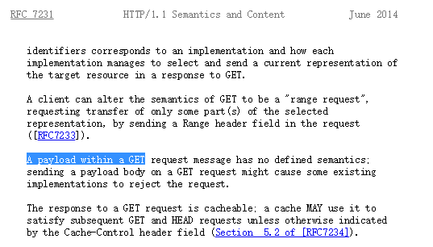

## 验证前端能 get 请求时能否在 body 传参数

> 前端 http 的 get 请求不能把参数放到 body 中
>
> 1. fetch get 请求若携带 body ，浏览器会报 **TypeError: Failed to execute 'fetch' on 'Window': Request with GET/HEAD method cannot have body.**
> 2. XMLHttpRequest get 请求，用 send() 发送参数，后台不接收

> 从协议方面来说，GET 是可以带 body 的
>
> - cmd 控制台输入 `curl http://127.0.0.1:3000?a=123 -d {a:'2'} -X GET` 能够通过 get 方法传递 body 参数

- [谁说 HTTP GET 就不能通过 Body 来发送数据呢？](https://yanbin.blog/why-http-get-cannot-sent-data-with-reuqest-body/#more-8193)
- [RFC7231(Page 25)](https://tools.ietf.org/html/rfc7231)
